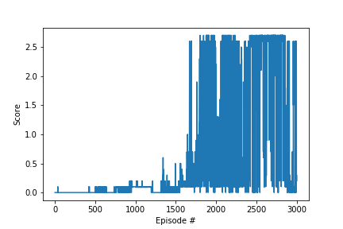

# P3_collab_compet_DRLND

In this project we will use The tennis environment created by Unity.


The environment contains two agents which are Two rackets can bounce ball to each other ove a net.  If an agent hits the ball over the net, it receives a reward of +0.1. If an agent lets a ball hit the ground or hits the ball out of bounds, it receives a reward of -0.01.

The observation space consists of 8 variables corresponding to the position and velocity of the ball and racket. Each agent receives its own, local observation. Two continuous actions are available, corresponding to movement toward (or away from) the net, and jumping. 

## prerequisite installation:

* please follow the instructions in the [DRLND GitHub repository](https://github.com/udacity/deep-reinforcement-learning) to set up your Python environment. By following these instructions, you will install PyTorch, the ML-Agents toolkit, and a few more Python packages required to complete the project.

* Download the unity environment:
  * [Linux](https://s3-us-west-1.amazonaws.com/udacity-drlnd/P3/Tennis/Tennis_Linux.zip)
  * [Mac OSX](https://s3-us-west-1.amazonaws.com/udacity-drlnd/P3/Tennis/Tennis.app.zip)
  * [Windows (32-bit)](https://s3-us-west-1.amazonaws.com/udacity-drlnd/P3/Tennis/Tennis_Windows_x86.zip)
  * [Windows (64-bit)](https://s3-us-west-1.amazonaws.com/udacity-drlnd/P3/Tennis/Tennis_Windows_x86_64.zip)
  
The downloaded file is needed to extract in repository folder.

## Train the agent:

open jupyter notebook by terminal:
```
jupyter notebook
```

change kernel ***python3*** to ***drlnd***:


After following the instructions above, open Continuous_Control.ipynb 

And run every cell except:
```
env.close()
```

In the end, one can get average reward graph plot over the every episodes.


