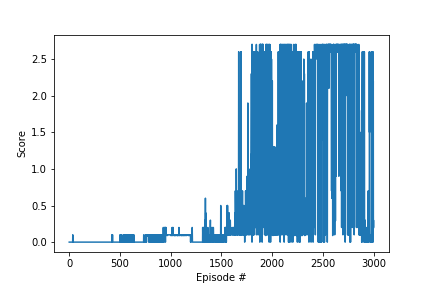

DDPG(Deep Deterministic policy gradient) present an actor-critic, model-free algorithm based on the deterministic policy gradient that can operate over continuous action spaces. It is not possible to straightforwardly apply Q-learning to continuous action spaces, because in continuous spaces finding the greedy policy requires an optimization of actions at every timestep; this optimization is too slow to be practical with large, unconstrained function approximators and nontrivial action spaces.  Instead, here we used an actor-critic approach based on the DPG algorithm

In this method One can create neural network for actor and critic both.
The achitecture for both agent as structured below:

Actor NN achitecute with batchnormalization in every hidden layer:

***Input state(24) -> hidden_1 (128) -> hidden_1 (64) -> output_action (2)***

Critic NN architecture with batchnormalization in every hidden layer:

***Input state (24) -> concat_with_action (128+2) -> hidden_1(64) -> output_action (1)***

The hyperparameters:

  * Buffer size: 1,000,000
  * Batch size: 1024
  * Actor nn learning rate: 0.0001
  * Critic nn learning rate: 0.001
  * discount factor: 0.99
  * weight decay: 0
  * tau: 0.001

We have passed training dataset randomly 10 times to train actor and critic network. 

## plot of average reward over total episodes:

## Future Idea:

alphazero can be used for future to train agents more precisely. it consists of a Monte Carlo tree search, guided by a deep neural network. This is analogous to the way humans think about board games -- where professional players employ hard calculations guides with intuitions. 
